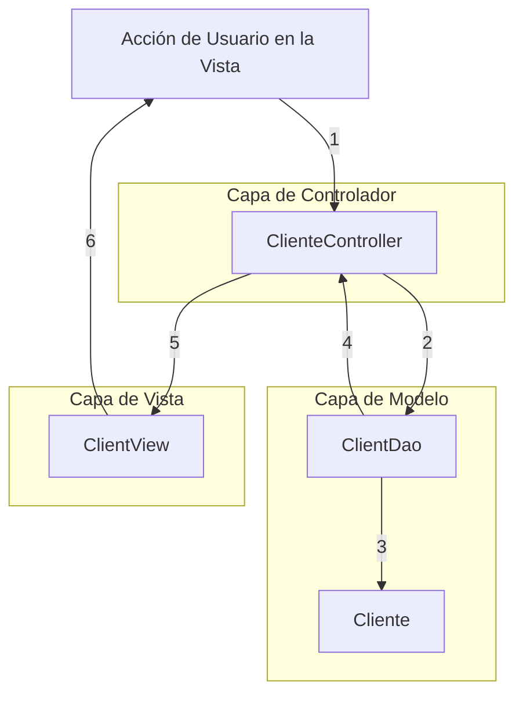
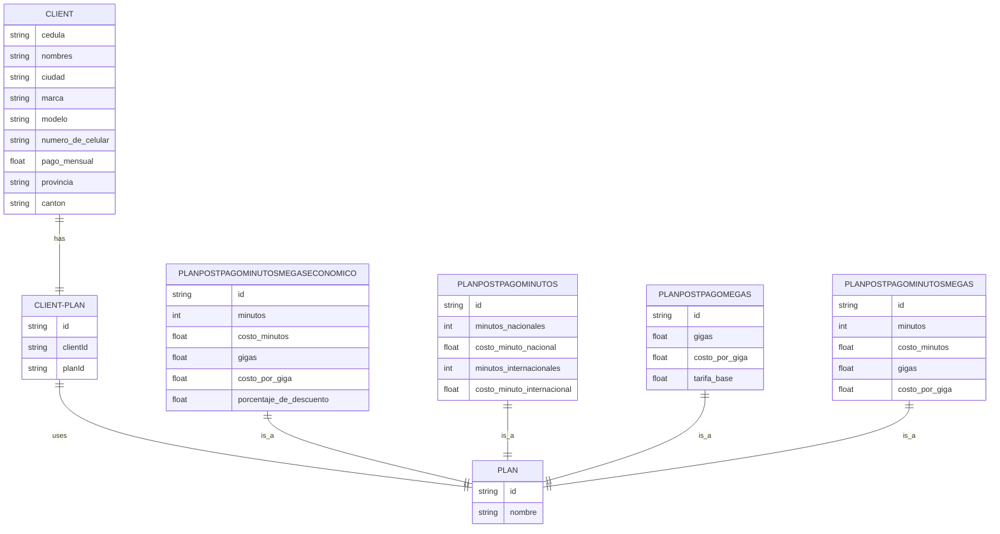

# Análisis y diseño de la aplicación Mov-UTPL

## Análisis

1. **Requisitos funcionales**: Basándonos en los datos básicos del cliente proporcionados y los diferentes planes, podemos establecer varios requisitos funcionales. Esto incluiría operaciones de creación, lectura, actualización y eliminación (CRUD) de clientes y planes. Además, la aplicación debería ser capaz de generar facturas basadas en los planes de cada cliente.

| Número | Requerimiento                                               | Asignado a | Completado | Tested |
| ------ | ----------------------------------------------------------- | ---------- | :--------: | :----: |
| RM-01  | Agregar un nuevo cliente                                    | Daniel     |    [x]     |        |
| RM-02  | Editar la información de un cliente existente               | Daniel     |    [x]     |        |
| RM-03  | Eliminar un cliente                                         | Daniel     |    [x]     |        |
| RM-04  | Visualizar la información de un cliente                     | Daniel     |    [x]     |        |
| RM-05  | Listar todos los clientes                                   | Daniel     |    [x]     |        |
| RM-06  | Agregar un nuevo plan de telefonía móvil                    | Juan       |            |        |
| RM-07  | Editar la información de un plan existente                  | Juan       |            |        |
| RM-08  | Eliminar un plan                                            | Juan       |            |        |
| RM-09  | Visualizar la información de un plan                        | Juan       |            |        |
| RM-10  | Listar todos los planes de telefonía móvil                  | Juan       |            |        |
| RM-11  | Asociar un plan a un cliente                                | Renato     |            |        |
| RM-12  | Desasociar un plan de un cliente                            | Renato     |            |        |
| RM-13  | Visualizar los planes asociados a un cliente                | Renato     |            |        |
| RM-14  | Generar una factura para un cliente                         | Renato     |            |        |
| RM-15  | Visualizar una factura generada                             | Renato     |            |        |
| RM-16  | Listar todas las facturas generadas                         | Renato     |            |        |
| RM-17  | Calcular el costo de cada tipo de plan                      | Renato     |            |        |
| RM-18  | Guardar y recuperar todos los datos relevantes en/de una DB | Renato     |            |        |

2. **Requisitos no funcionales**: La aplicación debería usar SQLite como motor de base de datos. Debe seguir los principios de la arquitectura MVC y utilizar el paradigma de la programación orientada a objetos (POO) utilizando conceptos como la herencia y el polimorfismo.

   Los requerimientos no funcionales son aquellos que no están directamente relacionados con la funcionalidad específica del sistema, sino con cómo se desempeña el sistema. A continuación, se muestran algunos posibles requerimientos no funcionales para este proyecto:

   1. **Usabilidad**: La interfaz de usuario del sistema debe ser fácil de usar y entender.
2. **Mantenibilidad**: El código del sistema debe estar bien organizado, bien comentado y seguir las mejores prácticas de programación. Esto facilitará cualquier mantenimiento o mejora futura del sistema.
   3. **Extensibilidad**: El sistema debe ser diseñado de tal manera que sea fácil agregar nuevas características o modificar las existentes.
4. **Persistencia de Datos**: El sistema debe garantizar la persistencia de los datos incluso en caso de fallas del sistema.
   

Pueden existir otros requerimientos que a lo largo del proyecto se irán contemplando.

## Diseño

1. **Arquitectura**: Deberíamos adoptar una arquitectura MVC (Modelo-Vista-Controlador) para este sistema. Esto significa que el sistema estará dividido en tres partes interconectadas:

   - **Modelo**: Contendrá la lógica empresarial y se ocupará de la interacción con la base de datos.

   - **Vista**: Representará la interfaz de usuario y mostrará la información al usuario.

   - **Controlador**: Gestionará la comunicación entre el modelo y la vista.

2. **UML**: Para representar nuestra arquitectura y la interacción entre diferentes componentes, utilizaremos diagramas UML (Unified Modeling Language). Los diagramas UML también ayudarán a ilustrar el uso de la herencia y el polimorfismo en el sistema.

3. **Base de datos**: Como se especifica en los requerimientos, utilizaremos SQLite como motor de base de datos. En la base de datos, habrá tablas para almacenar información de clientes, planes y facturas.

## MVC

En el siguiente diagrama de flujo se muestra como interactuan las clases relacionadas a Cliente en el Modelo-Vista-Controlador:



Se sigue el siguiente flujo:

1. Un usuario realiza una acción en la vista, por ejemplo, hacer clic en un botón para crear un nuevo cliente.
2. Esta acción es manejada por el controlador (`ClienteController`).
3. El controlador utiliza `ClientDao` (en la capa de modelo) para interactuar con la base de datos.
4. `ClientDao` realiza la operación en la base de datos y devuelve los resultados (si los hay) al controlador.
5. El controlador actualiza la vista con cualquier nuevo dato.
6. La vista muestra los datos actualizados al usuario. Y el ciclo puede repetirse con nuevas acciones del usuario.

Esto es una simplificación del proceso, pero muestra cómo cada componente en la arquitectura MVC tiene un papel definido y cómo se comunican entre sí.

## Modelo

El diagrama ER (Entidad-Relación) permite modelar la estructura de una base de datos. 



Este diagrama representa tres entidades principales: `CLIENT`, `CLIENT-PLAN` y `PLAN`. `CLIENT` representa a los clientes, `PLAN` representa los diferentes tipos de planes disponibles, y `CLIENT-PLAN` representa la relación entre los clientes y los planes. Los clientes pueden tener uno o dos planes, y cada plan puede ser utilizado por muchos clientes. Los diferentes tipos de planes heredan de la entidad `PLAN`.

## Diagrama de clases

La siguiente es una versión simplificada de cómo podrían organizarse las clases para este proyecto utilizando el patrón MVC (Modelo-Vista-Controlador) y el lenguaje de programación Java. 

```mermaid
classDiagram
      class Cliente {
          +String id
          +String nombres
          +String pasaporte_cedula
          +String ciudad
          +String marca
          +String modelo
          +String numero_de_celular
          +double pago_mensual
          +String atributo_adicional_1
          +String atributo_adicional_2
          +Plan[] planes
      }
      class Plan {
          +String id
          +String nombre
          +double calcularCosto()
      }
      Plan <|-- PlanPostPagoMinutosMegasEconomico
      Plan <|-- PlanPostPagoMinutos
      Plan <|-- PlanPostPagoMegas
      Plan <|-- PlanPostPagoMinutosMegas
      class PlanPostPagoMinutosMegasEconomico {
          +int minutos
          +double costo_minutos
          +double gigas
          +double costo_por_giga
          +double porcentaje_de_descuento
          +double calcularCosto()
      }
      class PlanPostPagoMinutos {
          +int minutos_nacionales
          +double costo_minuto_nacional
          +int minutos_internacionales
          +double costo_minuto_internacional
          +double calcularCosto()
      }
      class PlanPostPagoMegas {
          +double gigas
          +double costo_por_giga
          +double tarifa_base
          +double calcularCosto()
      }
      class PlanPostPagoMinutosMegas {
          +int minutos
          +double costo_minutos
          +double gigas
          +double costo_por_giga
          +double calcularCosto()
      }
      class ClienteController {
          +void addCliente(Cliente cliente)
          +void deleteCliente(String id)
          +void updateCliente(Cliente cliente)
          +Cliente getCliente(String id)
      }
      class PlanController {
          +void addPlan(Plan plan)
          +void deletePlan(String id)
          +void updatePlan(Plan plan)
          +Plan getPlan(String id)
      }
      class FacturaController {
          +Factura generateFactura(Cliente cliente)
      }
      class Factura {
          +String id
          +Cliente cliente
          +double total
          +String generarDetalle()
      }
      class ClienteView {
          +void printClienteDetails(String clienteId, String clienteNombre, String clienteCiudad)
      }
      class FacturaView {
          +void printFacturaDetails(String facturaId, String clienteNombre, double total)
      }
```


Este diagrama de clases representa las relaciones entre las clases propuestas. Hay una clase `Cliente`, que tiene una relación con la clase `Plan` a través de un array (un cliente puede tener uno o dos planes). La clase `Plan` es una clase abstracta, de la que heredan las clases `PlanPostPagoMinutosMegasEconomico`, `PlanPostPagoMinutos`, `PlanPostPagoMegas` y `PlanPostPagoMinutosMegas`. Cada una de estas clases tiene un método `calcularCosto` que se implementará de manera diferente en cada subclase.

Para el patrón MVC, tenemos controladores `ClienteController`, `PlanController` y `FacturaController`, que administrarán las operaciones CRUD para los clientes, planes y facturas, respectivamente. También tenemos las clases `ClienteView` y `FacturaView` que se encargan de presentar la información al usuario.

Este diagrama de clases es una versión inicial, se puede requerir más clases para garantizar la persistencia de los datos.

## Estructura del proyecto

La estructura de un proyecto de Java utilizando el patrón MVC (Modelo-Vista-Controlador) es la siguiente:

```
Mov-UTPL
│
├───src
│   ├───main
│   │   ├───java
│   │   │   ├───com
│   │   │   │   ├───utpl
│   │   │   │   │   ├───mov
│   │   │   │   │   │   ├───controller
│   │   │   │   │   │   │   ├───ClienteController.java
│   │   │   │   │   │   │   ├───PlanController.java
│   │   │   │   │   │   │   └───FacturaController.java
│   │   │   │   │   │   ├───model
│   │   │   │   │   │   │   ├───Cliente.java
│   │   │   │   │   │   │   ├───Plan.java
│   │   │   │   │   │   │   ├───PlanPostPagoMinutosMegasEconomico.java
│   │   │   │   │   │   │   ├───PlanPostPagoMinutos.java
│   │   │   │   │   │   │   ├───PlanPostPagoMegas.java
│   │   │   │   │   │   │   ├───PlanPostPagoMinutosMegas.java
│   │   │   │   │   │   │   └───Factura.java
│   │   │   │   │   │   └───view
│   │   │   │   │   │       ├───ClienteView.java
│   │   │   │   │   │       └───FacturaView.java
│   │   │   │   │   └───utils
│   │   │   │   │       └───DBUtil.java
│   │   ├───resources
│   │   │   └───db
│   │   │       └───movutpl.db
│   └───test
│       └───java
│           └───com
│               └───utpl
│                   └───mov
│                       └───controller
│                           ├───ClienteControllerTest.java
│                           ├───PlanControllerTest.java
│                           └───FacturaControllerTest.java
├───.gitignore
├───pom.xml
└───README.md
```

Esta es una estructura de proyecto típica de Maven. 

- En el directorio `src/main/java` colocas todas las clases Java de la aplicación.

- En `src/main/resources` colocamos los recursos, como archivos de configuración. En este caso, se ha colocado una base de datos SQLite en el directorio `src/main/resources/db`.

- En `src/test/java` colocas todas las pruebas de tu aplicación.

- El archivo `pom.xml` es el archivo de configuración de Maven, que define las dependencias del proyecto y otras configuraciones.

- El archivo `.gitignore` es donde indicas a Git qué archivos o directorios no debería rastrear.

- El archivo `README.md` es donde puedes escribir la documentación de tu proyecto.

## Desarrollo

## DDL

A continuación se proporciona el Data Definition Language para la base de datos sqlite.

```sqlite
-- Tabla para almacenar información sobre los clientes
CREATE TABLE CLIENT (
    cedula TEXT UNIQUE NOT NULL PRIMARY KEY,
    nombres TEXT NOT NULL,
    ciudad TEXT NOT NULL,
    provincia TEXT,
    canton TEXT,
    marca TEXT NOT NULL,
    modelo TEXT NOT NULL,
    numero_de_celular TEXT UNIQUE NOT NULL,
    pago_mensual REAL NOT NULL
);

-- Tabla para la relación entre clientes y planes
CREATE TABLE CLIENT_PLAN (
    id TEXT PRIMARY KEY,
    clientId TEXT NOT NULL,
    planId TEXT NOT NULL,
    FOREIGN KEY(clientId) REFERENCES CLIENT(id),
    FOREIGN KEY(planId) REFERENCES PLAN(id)
);

-- Tabla base para almacenar información general de los planes
CREATE TABLE PLAN (
    id TEXT PRIMARY KEY,
    nombre TEXT NOT NULL
);

-- Tabla para almacenar información de los planes de tipo PlanPostPagoMinutosMegasEconomico
CREATE TABLE PLANPOSTPAGOMINUTOSMEGASECONOMICO (
    id TEXT PRIMARY KEY,
    minutos INTEGER NOT NULL,
    costo_minutos REAL NOT NULL,
    gigas REAL NOT NULL,
    costo_por_giga REAL NOT NULL,
    porcentaje_de_descuento REAL NOT NULL,
    FOREIGN KEY(id) REFERENCES PLAN(id)
);

-- Tabla para almacenar información de los planes de tipo PlanPostPagoMinutos
CREATE TABLE PLANPOSTPAGOMINUTOS (
    id TEXT PRIMARY KEY,
    minutos_nacionales INTEGER NOT NULL,
    costo_minuto_nacional REAL NOT NULL,
    minutos_internacionales INTEGER NOT NULL,
    costo_minuto_internacional REAL NOT NULL,
    FOREIGN KEY(id) REFERENCES PLAN(id)
);

-- Tabla para almacenar información de los planes de tipo PlanPostPagoMegas
CREATE TABLE PLANPOSTPAGOMEGAS (
    id TEXT PRIMARY KEY,
    gigas REAL NOT NULL,
    costo_por_giga REAL NOT NULL,
    tarifa_base REAL NOT NULL,
    FOREIGN KEY(id) REFERENCES PLAN(id)
);

-- Tabla para almacenar información de los planes de tipo PlanPostPagoMinutosMegas
CREATE TABLE PLANPOSTPAGOMINUTOSMEGAS (
    id TEXT PRIMARY KEY,
    minutos INTEGER NOT NULL,
    costo_minutos REAL NOT NULL,
    gigas REAL NOT NULL,
    costo_por_giga REAL NOT NULL,
    FOREIGN KEY(id) REFERENCES PLAN(id)
);

```

Con este script creamos la estructura de nuestra base de datos, recordemos que todas las tablas de planes están relacionadas a la tabla PLAN por medio de sus llaves primarias replicando así la herencia.
