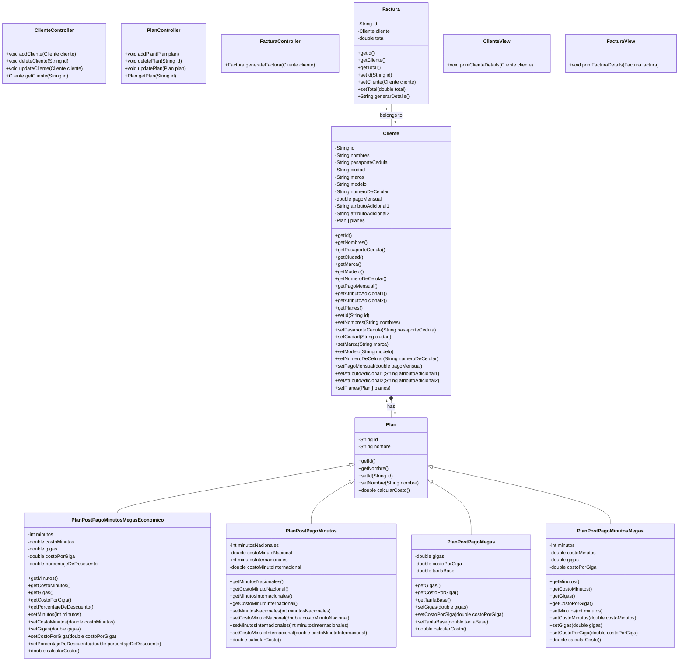

# Análisis y diseño de la aplicación Mov-UTPL

## Análisis

1. **Requisitos funcionales**: Basándonos en los datos básicos del cliente proporcionados y los diferentes planes, podemos establecer varios requisitos funcionales. Esto incluiría operaciones de creación, lectura, actualización y eliminación (CRUD) de clientes y planes. Además, la aplicación debería ser capaz de generar facturas basadas en los planes de cada cliente.

| Número | Requerimiento                                               | Asignado a | Completado | Tested |
| ------ | ----------------------------------------------------------- | ---------- | :--------: | :----: |
| RM-01  | Agregar un nuevo cliente                                    | Daniel     |    [x]     | [x]    |
| RM-02  | Editar la información de un cliente existente               | Daniel     |    [x]     | [x]    |
| RM-03  | Eliminar un cliente                                         | Daniel     |    [x]     | [x]    |
| RM-04  | Visualizar la información de un cliente                     | Daniel     |    [x]     | [x]    |
| RM-05  | Listar todos los clientes                                   | Daniel     |    [x]     | [x]    |
| RM-06  | Agregar un nuevo plan de telefonía móvil                    | Juan       |            |        |
| RM-07  | Editar la información de un plan existente                  | Juan       |            |        |
| RM-08  | Eliminar un plan                                            | Juan       |            |        |
| RM-09  | Visualizar la información de un plan                        | Juan       |            |        |
| RM-10  | Listar todos los planes de telefonía móvil                  | Juan       |            |        |
| RM-11  | Asociar un plan a un cliente                                | Renato     |            |        |
| RM-12  | Desasociar un plan de un cliente                            | Renato     |            |        |
| RM-13  | Visualizar los planes asociados a un cliente                | Renato     |            |        |
| RM-14  | Generar una factura para un cliente                         | Renato     |            |        |
| RM-15  | Visualizar una factura generada                             | Renato     |            |        |
| RM-16  | Listar todas las facturas generadas                         | Renato     |            |        |
| RM-17  | Calcular el costo de cada tipo de plan                      | Renato     |            |        |
| RM-18  | Guardar y recuperar todos los datos relevantes en/de una DB | Renato     |            |        |

2. **Requisitos no funcionales**: La aplicación debería usar SQLite como motor de base de datos. Debe seguir los principios de la arquitectura MVC y utilizar el paradigma de la programación orientada a objetos (POO) utilizando conceptos como la herencia y el polimorfismo.

   Los requerimientos no funcionales son aquellos que no están directamente relacionados con la funcionalidad específica del sistema, sino con cómo se desempeña el sistema. A continuación, se muestran algunos posibles requerimientos no funcionales para este proyecto:

   1. **Usabilidad**: La interfaz de usuario del sistema debe ser fácil de usar y entender.
2. **Mantenibilidad**: El código del sistema debe estar bien organizado, bien comentado y seguir las mejores prácticas de programación. Esto facilitará cualquier mantenimiento o mejora futura del sistema.
   3. **Extensibilidad**: El sistema debe ser diseñado de tal manera que sea fácil agregar nuevas características o modificar las existentes.
4. **Persistencia de Datos**: El sistema debe garantizar la persistencia de los datos incluso en caso de fallas del sistema.
   

Pueden existir otros requerimientos que a lo largo del proyecto se irán contemplando.

## Diseño

1. **Arquitectura**: Deberíamos adoptar una arquitectura MVC (Modelo-Vista-Controlador) para este sistema. Esto significa que el sistema estará dividido en tres partes interconectadas:

   - **Modelo**: Contendrá la lógica empresarial y se ocupará de la interacción con la base de datos.

   - **Vista**: Representará la interfaz de usuario y mostrará la información al usuario.

   - **Controlador**: Gestionará la comunicación entre el modelo y la vista.

2. **UML**: Para representar nuestra arquitectura y la interacción entre diferentes componentes, utilizaremos diagramas UML (Unified Modeling Language). Los diagramas UML también ayudarán a ilustrar el uso de la herencia y el polimorfismo en el sistema.

3. **Base de datos**: Como se especifica en los requerimientos, utilizaremos SQLite como motor de base de datos. En la base de datos, habrá tablas para almacenar información de clientes, planes y facturas.

## MVC

En el siguiente diagrama de flujo se muestra como interactuan las clases relacionadas a Cliente en el Modelo-Vista-Controlador:


Se sigue el siguiente flujo:

1. Un usuario realiza una acción en la vista, por ejemplo, hacer clic en un botón para crear un nuevo cliente.
2. Esta acción es manejada por el controlador (`ClienteController`).
3. El controlador utiliza `ClientDao` (en la capa de modelo) para interactuar con la base de datos.
4. `ClientDao` realiza la operación en la base de datos y devuelve los resultados (si los hay) al controlador.
5. El controlador actualiza la vista con cualquier nuevo dato.
6. La vista muestra los datos actualizados al usuario. Y el ciclo puede repetirse con nuevas acciones del usuario.

Esto es una simplificación del proceso, pero muestra cómo cada componente en la arquitectura MVC tiene un papel definido y cómo se comunican entre sí.

## Modelo 📱

El diagrama ER (Entidad-Relación) permite modelar la estructura de una base de datos. 


Este diagrama representa tres entidades principales: `CLIENT`, `CLIENT-PLAN` y `PLAN`. `CLIENT` representa a los clientes, `PLAN` representa los diferentes tipos de planes disponibles, y `CLIENT-PLAN` representa la relación entre los clientes y los planes. Los clientes pueden tener uno o dos planes, y cada plan puede ser utilizado por muchos clientes. Los diferentes tipos de planes heredan de la entidad `PLAN`.

## Diagrama de clases 

La siguiente es una versión simplificada de cómo podrían organizarse las clases para este proyecto utilizando el patrón MVC (Modelo-Vista-Controlador) y el lenguaje de programación Java. 


Este diagrama de clases representa las relaciones entre las clases propuestas. Hay una clase `Cliente`, que tiene una relación con la clase `Plan` a través de un array (un cliente puede tener uno o dos planes). La clase `Plan` es una clase abstracta, de la que heredan las clases `PlanPostPagoMinutosMegasEconomico`, `PlanPostPagoMinutos`, `PlanPostPagoMegas` y `PlanPostPagoMinutosMegas`. Cada una de estas clases tiene un método `calcularCosto` que se implementará de manera diferente en cada subclase.

Para el patrón MVC, tenemos controladores `ClienteController`, `PlanController` y `FacturaController`, que administrarán las operaciones CRUD para los clientes, planes y facturas, respectivamente. También tenemos las clases `ClienteView` y `FacturaView` que se encargan de presentar la información al usuario.

Este diagrama de clases es una versión inicial, se puede requerir más clases para garantizar la persistencia de los datos.

## Estructura del proyecto

La estructura de un proyecto de Java utilizando el patrón MVC (Modelo-Vista-Controlador) es la siguiente:

```
Mov-UTPL
│
├───src/
│   ├───main/
│   │   ├───java/
│   │   │   ├───com/
│   │   │   │   ├───utpl/
│   │   │   │   │   ├───mov/
│   │   │   │   │   │   ├───controller/
│   │   │   │   │   │   │   ├───ClienteController.java
│   │   │   │   │   │   │   ├───PlanController.java
│   │   │   │   │   │   │   └───FacturaController.java
│   │   │   │   │   │   ├───model/
│   │   │   │   │   │   │   ├───Cliente.java
│   │   │   │   │   │   │   ├───Plan.java
│   │   │   │   │   │   │   ├───PlanPostPagoMinutosMegasEconomico.java
│   │   │   │   │   │   │   ├───PlanPostPagoMinutos.java
│   │   │   │   │   │   │   ├───PlanPostPagoMegas.java
│   │   │   │   │   │   │   ├───PlanPostPagoMinutosMegas.java
│   │   │   │   │   │   │   └───Factura.java
|	│   │   │   │   │   │   ├───dao/
|	│   │   │   │   │   │   │   ├───ClienteDAO.java
|	│   │   │   │   │   │   │   ├───PlanDAO.java
|	│   │   │   │   │   │   │   ├───PlanPostPagoMinutosMegasEconomicoDAO.java
|	│   │   │   │   │   │   │   ├───PlanPostPagoMinutosDAO.java
|	│   │   │   │   │   │   │   ├───PlanPostPagoMegasDAO.java
|	│   │   │   │   │   │   │   ├───PlanPostPagoMinutosMegasDAO.java
|	│   │   │   │   │   │   │   └───FacturaDAO.java
│   │   │   │   │   │   └───view/
│   │   │   │   │   │       ├───ClienteView.java
│   │   │   │   │   │       └───FacturaView.java
│   │   │   │   │   └───utils/
│   │   │   │   │       └───DBUtil.java
│   │   ├───resources/
│   │   │   └───db/
│   │   │       └───movutpl.db
│   └───test
│       └───java
│           └───com
│               └───utpl
│                   └───mov
│                       └───controller/
│                           ├───ClienteControllerTest.java
│                           ├───PlanControllerTest.java
│                           └───FacturaControllerTest.java
├───.gitignore
├───pom.xml
└───README.md
```

Esta es una estructura de proyecto típica de Maven. 

- En el directorio `src/main/java` colocas todas las clases Java de la aplicación.

- En `src/main/resources` colocamos los recursos, como archivos de configuración. En este caso, se ha colocado una base de datos SQLite en el directorio `src/main/resources/db`.

- En `src/test/java` colocas todas las pruebas de tu aplicación.

- El archivo `pom.xml` es el archivo de configuración de Maven, que define las dependencias del proyecto y otras configuraciones.

- El archivo `.gitignore` es donde indicas a Git qué archivos o directorios no debería rastrear.

- El archivo `README.md` es donde puedes escribir la documentación de tu proyecto.

## Desarrollo

## DDL

A continuación se proporciona el Data Definition Language para la base de datos sqlite.

```sqlite
-- Tabla para almacenar información sobre los clientes
CREATE TABLE CLIENT (
    cedula TEXT UNIQUE NOT NULL PRIMARY KEY,
    nombres TEXT NOT NULL,
    ciudad TEXT NOT NULL,
    provincia TEXT,
    canton TEXT,
    marca TEXT NOT NULL,
    modelo TEXT NOT NULL,
    numero_de_celular TEXT UNIQUE NOT NULL,
    pago_mensual REAL NOT NULL
);

-- Tabla para la relación entre clientes y planes
CREATE TABLE CLIENT_PLAN (
    id TEXT PRIMARY KEY,
    clientId TEXT NOT NULL,
    planId TEXT NOT NULL,
    FOREIGN KEY(clientId) REFERENCES CLIENT(id),
    FOREIGN KEY(planId) REFERENCES PLAN(id)
);

-- Tabla base para almacenar información general de los planes
CREATE TABLE PLAN (
    id TEXT PRIMARY KEY,
    nombre TEXT NOT NULL
);

-- Tabla para almacenar información de los planes de tipo PlanPostPagoMinutosMegasEconomico
CREATE TABLE PLANPOSTPAGOMINUTOSMEGASECONOMICO (
    id TEXT PRIMARY KEY,
    minutos INTEGER NOT NULL,
    costo_minutos REAL NOT NULL,
    gigas REAL NOT NULL,
    costo_por_giga REAL NOT NULL,
    porcentaje_de_descuento REAL NOT NULL,
    FOREIGN KEY(id) REFERENCES PLAN(id)
);

-- Tabla para almacenar información de los planes de tipo PlanPostPagoMinutos
CREATE TABLE PLANPOSTPAGOMINUTOS (
    id TEXT PRIMARY KEY,
    minutos_nacionales INTEGER NOT NULL,
    costo_minuto_nacional REAL NOT NULL,
    minutos_internacionales INTEGER NOT NULL,
    costo_minuto_internacional REAL NOT NULL,
    FOREIGN KEY(id) REFERENCES PLAN(id)
);

-- Tabla para almacenar información de los planes de tipo PlanPostPagoMegas
CREATE TABLE PLANPOSTPAGOMEGAS (
    id TEXT PRIMARY KEY,
    gigas REAL NOT NULL,
    costo_por_giga REAL NOT NULL,
    tarifa_base REAL NOT NULL,
    FOREIGN KEY(id) REFERENCES PLAN(id)
);

-- Tabla para almacenar información de los planes de tipo PlanPostPagoMinutosMegas
CREATE TABLE PLANPOSTPAGOMINUTOSMEGAS (
    id TEXT PRIMARY KEY,
    minutos INTEGER NOT NULL,
    costo_minutos REAL NOT NULL,
    gigas REAL NOT NULL,
    costo_por_giga REAL NOT NULL,
    FOREIGN KEY(id) REFERENCES PLAN(id)
);

```

Con este script creamos la estructura de nuestra base de datos, recordemos que todas las tablas de planes están relacionadas a la tabla PLAN por medio de sus llaves primarias replicando así la herencia.

## 🧪 Pruebas unitarias

